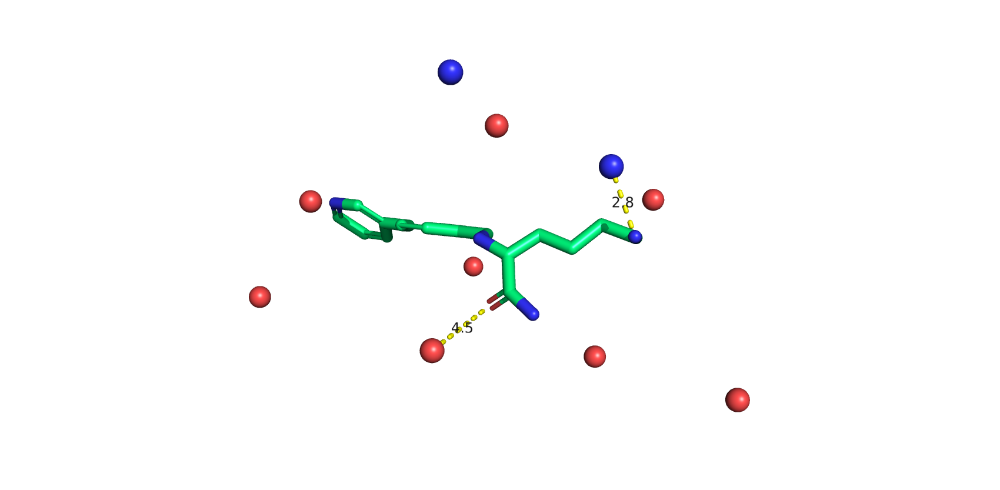

# synthVS

This repository contains an implementation of synthVS, the method described in the paper "Exploring The Ability Of Machine Learning-Based Virtual Screening Models To Identify The Functional Groups Responsible For Binding", by Thomas E. Hadfield, Jack Scantlebury, and Charlotte M. Deane.

Users can generate their own synthetic protein-ligand complexes and use them to train virtual screening models. The deterministic binding rule allows assessment of the extent to which a VS model can correctly identify the functional groups responsible for binding.



## Installing synthVS

For the time being, synthVS requires the installation of [PointVS](https://github.com/jscant/PointVS) as a prerequisite. A more lightweight installation will soon be available. 

synthVS can be installed by running the following commands:

```
git clone git@github.com:jscant/PointVS
cd PointVS
conda env create -f environment.yml python=3.8
conda activate pointvs
pip install -e .
cd ..
git clone git@github.com:tomhadfield95/synthVS
cd synthVS
```


## Generating datasets with synthVS

To generate a dataset of synthetic protein-ligand complexes, we require an sdf file containing a set of ligands with 3D poses. We can then pass this file to the script `ds_generation/main.py`, which takes the following arguments

```
positional arguments:
  ligands               Location of ligand sdf(s)
  output_dir            Directory in which to store outputs

optional arguments:
  -h, --help            show this help message and exit
  --max_pharmacophores MAX_PHARMACOPHORES, -m MAX_PHARMACOPHORES
                        Maximum number of pharmacophores for each ligand
  --area_coef AREA_COEF, -a AREA_COEF
  --mean_pharmacophores MEAN_PHARMACOPHORES, -p MEAN_PHARMACOPHORES
                        Mean number of pharmacophores for each ligand
  --num_opportunities NUM_OPPORTUNITIES, -n NUM_OPPORTUNITIES
                        Number of interaction opportunities per ligand.
  --distance_threshold DISTANCE_THRESHOLD, -t DISTANCE_THRESHOLD
                        Maximum distance between ligand functional groups and their respective pharmacophores for the combination of the two to be
                        considered an active
  --hydrophobic, -hy    Include hydrophobic residues in the pharmacophore generation process
  --score_threshold SCORE_THRESHOLD, -st SCORE_THRESHOLD
                        Threshold for interaction scoring which determines whether an example will be active or not
  --force_labels FORCE_LABELS, -f FORCE_LABELS
                        Attempts to generate ligands until the desired label is obtained; this arg can be either 0 or 1, which sets the label, or 2, in
                        which case whether something is labelled as a binding or non-binding structure depends on whether the filename has "active" or
                        either "inactive" or "decoy" in its path.
  --use_multiprocessing, -mp
                        Use multiple CPU processes
  --simplify_labelling, -sl
                        only use positives with a single interaction
```

To generate a set of synthetic protein-ligand complexes, using the "Polar" generative process, run 

```
python3 ds_generation/main.py <INPUT.sdf> <OUTPUT_DIR> -n 50 -a 0.025 -t 4.0 -mp
```

To use the "Contribution" generative process, run 

```
python3 ds_generation/main.py <INPUT.sdf> <OUTPUT_DIR> -n 50 -a 0.025 -hy -st 4.0 -mp
```

NOTE: The parameters `-n`, `-a`, can be changed to alter the synthetic proteins produced, whereas the parameters `-t`, `-st` affect the label given to the synthetic protein-ligand complex by the deterministic binding rule.

## Downstream tasks

Once you have generated a synthetic dataset, you can use it to train structure-based virtual screening models, and assess the ability of your model to identify the most important functional groups according to the deterministic binding rule. Examples on how to conduct various downstream tasks can be found in the `scripts` directory.

* The `ds_generation/convert_to_numpy.py` script can be used to convert a set of synthetic protein-ligand complexes to fingerprints and save them as `numpy` arrays which can then be used as the input to a `scikit-learn` model.
* The `fit_rf.py` script can be used to train random forest models on molecular fingerprints and save the trained model.
* The `compute_attributions_saved_model.py` script can be used to use atomic masking to assign a score to each ligand atom and rank them by importance.

Of course, you can run alternative downstream tasks to the ones implemented in this repository. In particular, you can use the generated datasets as input to your own SBVS models to assess their ability to extract important spatial information, relative to other SBVS models.
